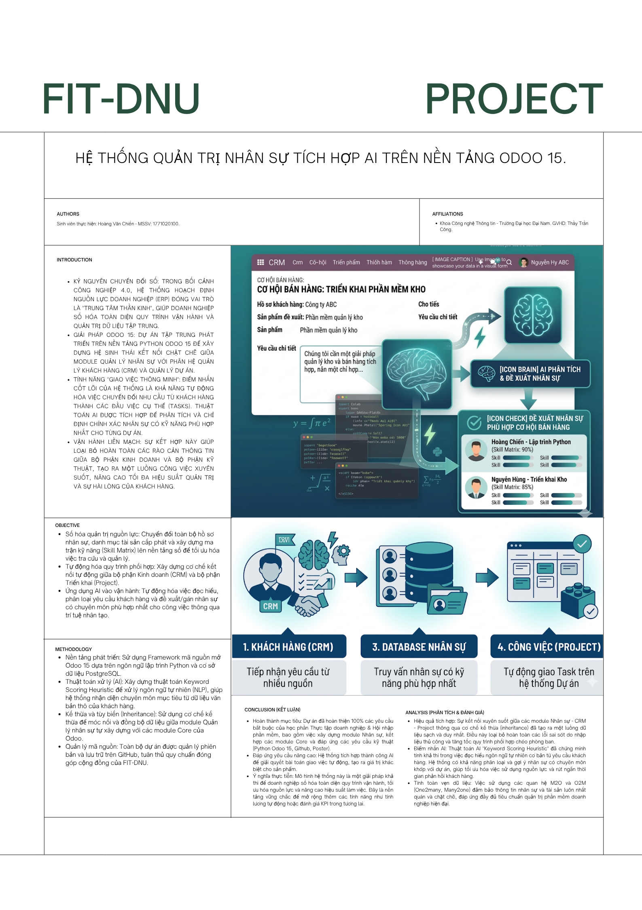

<h2 align="center">
    <a href="https://dainam.edu.vn/vi/khoa-cong-nghe-thong-tin">
    🎓 Faculty of Information Technology (DaiNam University)
    </a>
</h2>
<h2 align="center">
    PLATFORM ERP - PHÂN HỆ QUẢN TRỊ NHÂN SỰ TÍCH HỢP AI
</h2>
<div align="center">
    <p align="center">
        
        
        
    </p>

[](https://www.facebook.com/DNUAIoTLab)
[](https://dainam.edu.vn/vi/khoa-cong-nghe-thong-tin)
[](https://dainam.edu.vn)

</div>

## 📖 1. Giới thiệu dự án
Dự án được thực hiện bởi sinh viên **Hoàng Văn Chiến (1771020100)** trong khuôn khổ học phần Thực tập doanh nghiệp. Hệ thống tập trung vào việc xây dựng module **Quản lý Nhân sự (nhan_su)**, kết nối chặt chẽ với CRM và Project Task.

### 🖼️ Poster giới thiệu hệ thống
<div align="center">
    <h2>🖼️ Poster giới thiệu hệ thống</h2>
    
</div>
## ✨ 2. Tính năng tiêu biểu (Advanced Features)
Hệ thống áp dụng mô hình "Giao việc thông minh" bằng Trí tuệ nhân tạo:
- **AI Scoring Heuristic**: Tự động phân tích yêu cầu khách hàng từ CRM để chấm điểm trọng số từ khóa chuyên môn.
- **Smart Matching**: Tự động truy vấn Ma trận kỹ năng (Skill Matrix) trong module Nhân sự để tìm nhân viên phù hợp nhất.
- **Auto-Task Assignment**: Tự động khởi tạo và gán việc đích danh trên phân hệ Dự án, giúp quy trình vận hành không bị gián đoạn.

## 🔧 3. Các công nghệ được sử dụng
<div align="center">

### Hệ điều hành & Công cụ
[](https://ubuntu.com/)
[](https://git-scm.com/)

### Công nghệ lõi
[](https://www.odoo.com/)
[](https://www.python.org/)
[](https://www.postgresql.org/)
[](https://www.w3.org/XML/)

</div>

## ⚙️ 4. Cài đặt hệ thống

### 4.1. Tải dự án và cài đặt môi trường
```bash
# Clone dự án
git clone [https://github.com/Chien2711/NHOM_13-ODOO.git](https://github.com/Chien2711/NHOM_13-ODOO.git)

# Cài đặt các thư viện hệ thống cần thiết
sudo apt-get install libxml2-dev libxslt-dev libldap2-dev libsasl2-dev libssl-dev python3.10-distutils python3.10-dev build-essential libssl-dev libffi-dev zlib1g-dev python3.10-venv libpq-dev

# Khởi tạo môi trường ảo và cài đặt requirements
python3.10 -m venv ./venv
source venv/bin/activate
pip3 install -r requirements.txt

Setup Database & Config

Khởi tạo database (Docker):
sudo docker-compose up -d
Cấu hình tệp odoo.conf:
[options]
addons_path = addons, your_custom_addons_path
db_host = localhost
db_password = odoo
db_user = odoo
db_port = 5431
xmlrpc_port = 8069

Khởi chạy hệ thống

python3 odoo-bin.py -c odoo.conf -u nhan_su
Truy cập: http://localhost:8069/

Thông tin tác giả
Sinh viên: Hoàng Văn Chiến

MSSV: 1771020100

GVHD: Thầy Công

Lớp: K17-CNTT